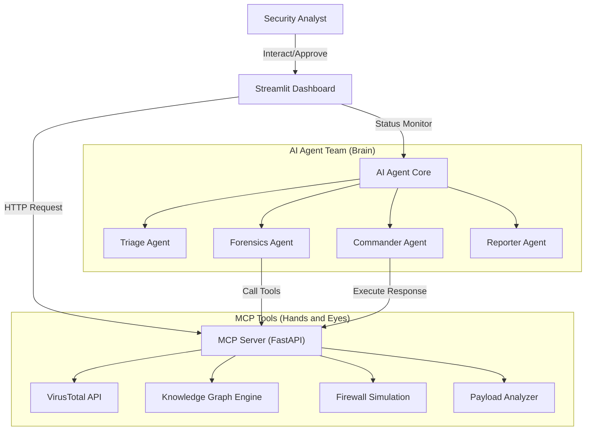

<div align="center">
  
</div>

# 🛡️ Agentic SOC Simulation (ASS): Next-Gen Autonomous Security Operations Center

> **Redefining the Future of Security Operations: Deep Reasoning, Multi-Agent Collaboration, and Fully Automated Response**

[🇨🇳 中文文档 (Chinese Version)](README_CN.md)

This project is a **cutting-edge AI security experimental platform** designed to explore the extreme potential of **Large Action Models (LAM)** in the field of cybersecurity. By integrating the **DeepSeek Reasoning Model**, **Multi-Agent Collaboration**, and the **MCP (Model Context Protocol)** standard, we have built a virtual SOC team capable of **autonomous perception, deep reasoning, and automated response**.

Here, AI is no longer a simple script executor but a digital analyst with **expert-level Chain of Thought**. It can peel back the layers of massive alerts like a human expert, construct attack graphs, and take decisive action, elevating the efficiency of security operations to a new dimension.


📺 **YouTube Demo**: https://youtu.be/_gRINAQaKmo

[](https://youtu.be/_gRINAQaKmo)

## ✨ Key Highlights

*   **🧠 Cognitive AI Analyst**
    *   Powered by the **DeepSeek** strong reasoning engine, possessing human-like logical analysis and decision-making capabilities.
    *   Capable of handling ambiguous information, autonomously planning investigation paths, building complete chains of evidence, and achieving end-to-end automation from "alert" to "conclusion".

*   **🤖 Multi-Role Agent Swarm**
    *   Simulates a real SOC organizational structure with four distinct roles:
        *   **Triage**: Filters false positives and assesses alert credibility.
        *   **Forensics**: Invokes tools for deep investigation and constructs attack chains.
        *   **Commander**: Formulates response strategies, executes bans, or requests approval.
        *   **Reporter**: Summarizes investigation results and generates structured security reports.
    *   Seamless collaboration through shared context, demonstrating swarm intelligence superior to individual units.

*   **🕸️ Dynamic Threat Graph**
    *   Real-time visualization of attack chains based on `streamlit-agraph`.
    *   **Universal Graph Construction Engine**: Built-in attribution, interaction, and causality principles. Whether it's an APT attack or ransomware, it automatically constructs interlocking attack narratives.
    *   **No Isolated Nodes**: Enforces entity correlation, reorganizing fragmented clues (IPs, domains, files, vulnerabilities) into intuitive attack narratives.

*   **⚡️ GenAI Adversarial Simulation**
    *   Built-in **ScenarioGPT** engine leveraging LLM generation capabilities to one-click build high-fidelity, high-complexity customized attack scenarios (e.g., Log4j, ransomware, APT group activities).
    *   Supports "defense through offense," enabling Red vs. Blue exercises anytime, anywhere.

*   **🛡️ Async Human-AI Symbiosis**
    *   Innovative **HITL (Human-in-the-Loop)** mechanism ensures that while AI acts autonomously, critical decisions (like network-wide bans) remain under human expert supervision.
    *   **Non-Blocking Interaction**: Uses a `PENDING_APPROVAL` mechanism, allowing AI to continue other tasks after submitting high-risk operation requests, waiting for asynchronous confirmation from human experts on the dashboard.

*   **🔌 Open MCP Architecture**
    *   Adopts the industry-leading **Model Context Protocol (MCP)** for standardized toolchain integration.
    *   **Smart Tool Enhancement**: Built-in LLM-driven Payload Analyzer capable of accurately identifying advanced TTPs like obfuscated command execution and memory shell injection.
    *   Easily extend security capabilities such as Threat Intelligence (VirusTotal), EDR, Firewalls, etc.

## 🏗️ System Architecture

This project adopts a layered architecture design, simulating a real enterprise-grade security operations environment:



1.  **Dashboard (Streamlit)**: `app/main.py`
    - The visual command center for security analysts.
    - Responsible for injecting simulated alerts and displaying SOC team status.
    - Real-time display of the Agent's investigation process and knowledge graph.

2.  **MCP Server (FastAPI)**: `mcp_server/main.py`
    - Acts as the "hands and feet" of the Agent.
    - Provides standard APIs for Agent calls.
    - Contains logic for real/simulated security tools.

3.  **AI Agent (Python)**: `agent/core.py`
    - The "brain" of operations.
    - Responsible for interacting with the LLM, parsing intent, and executing the tool call loop.
    - Includes `ScenarioGenerator` for generating custom attack scenarios.

## ⚙️ Execution Flow Example (Lazarus APT Scenario)

The following demonstrates how the system handles a typical APT attack chain:

1.  **Alert Ingestion**: System receives a "Phishing Email Detected" alert.
2.  **Triage**: Triage Agent analyzes alert credibility, deems it high risk, and forwards it to Forensics.
3.  **Forensics**:
    - Calls `check_ip_reputation` to confirm the source IP is malicious.
    - Calls `analyze_payload` to identify the attachment as a malicious downloader.
    - Calls `graph_add_relation` to build the graph: `IP(45.33...)` --[Delivers]--> `Host(Workstation)`.
4.  **Correlation Analysis**: When a subsequent "C2 Connection" alert is received, the Forensic Agent automatically correlates it to the existing `Host(Workstation)` node, forming an attack chain.
5.  **Response (Commander)**: Determines the threat is confirmed and attempts to ban the C2 IP.
6.  **Human Approval (HITL)**: Triggers `PENDING_APPROVAL`, analyst clicks "Approve" on the interface.
7.  **Reporting (Reporter)**: Automatically generates a Markdown report containing the complete chain of evidence and disposal results.

## 🚀 Quick Start

### 1. Environment Preparation

Clone the project and install dependencies:

```bash
pip install -r requirements.txt
```

### 2. Start Services

You need to open two terminal windows to run the following commands respectively:

**Terminal 1: Start MCP Tool Server**
```bash
python3 -m uvicorn mcp_server.main:app --reload --port 8000
```

**Terminal 2: Start Web Dashboard**
```bash
python3 -m streamlit run app/main.py
```

### 3. Configuration & Experience

1.  **Access Interface**: Open your browser and visit `http://localhost:8501`.
2.  **Configure API Key**: Enter your `DeepSeek API Key` and `VirusTotal API Key` (optional) in the **"System Configuration"** sidebar. Configuration is valid only for the current session; no need to modify local files.
3.  **Select Mode**:
    *   **Lazarus APT Simulation**: Click the "Simulate Lazarus APT Attack Chain" button in the sidebar to experience a preset Advanced Persistent Threat scenario.
    *   **Custom Simulation**: Enter an attack description (e.g., "Simulate a SQL injection attack against a database") in the "Custom Simulation" area, then click Generate and Run.
4.  **Observe & Interact**:
    *   Watch the **"SOC Team"** area to see how AI engineers with different roles work in relay.
    *   View the real-time constructed attack chain in the **"Knowledge Graph"** area.
    *   When high-risk operations are encountered, approve or reject them in the **"Human Decision"** area.

## 📂 Project Structure

```
.
├── app/                # Frontend Interface (Streamlit)
│   └── main.py         # Main Program: UI Layout, State Management, Visualization
├── mcp_server/         # Tool Service (FastAPI)
│   └── main.py         # Provides APIs for IP Reputation, Firewall, Graph Management, etc.
├── agent/              # Agent Core Logic
│   └── core.py         # Defines Agent Class and ScenarioGenerator Class
├── requirements.txt    # Project Dependencies
└── README.md           # Project Documentation (English)
```
