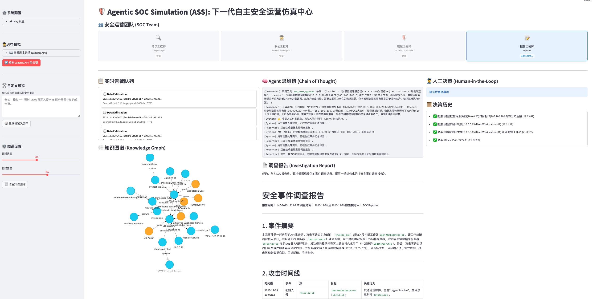
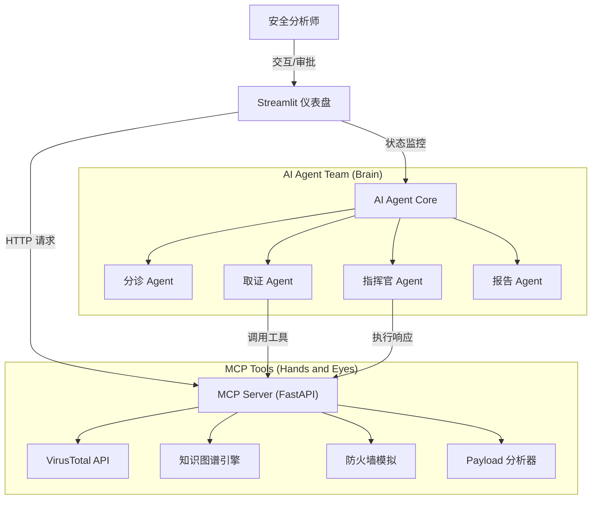

<div align="center">
  
</div>

# 🛡️ Agentic SOC Simulation (ASS): 下一代自主安全运营仿真中心

> **重新定义安全运营的未来：深度推理、多智能体协同与全自动响应**

本项目是一个**前沿的 AI 安全实验平台**，旨在探索 **Large Action Model (LAM)** 在网络安全领域的极限潜力。通过集成 **DeepSeek 推理大模型**、**多智能体协同 (Multi-Agent Collaboration)** 与 **MCP (Model Context Protocol)** 标准，我们构建了一个具备**自主感知、深度推理、自动处置**能力的虚拟 SOC 团队。

在这里，AI 不再是简单的脚本执行者，而是具备**专家级思维链 (Chain of Thought)** 的数字分析师。它能够像人类专家一样，从海量告警中抽丝剥茧，构建攻击图谱，并果断采取行动，将安全运营的效率提升至新的维度。



📺 **YouTube 演示视频**: https://youtu.be/_gRINAQaKmo

[](https://youtu.be/_gRINAQaKmo)

## ✨ 核心亮点 (Key Highlights)

*   **🧠 深度认知智能体 (Cognitive AI Analyst)**
    *   搭载 **DeepSeek** 强推理引擎，具备类人的逻辑分析与决策能力。
    *   能够处理模糊信息，自主规划调查路径，构建完整的证据链，实现从“告警”到“结论”的端到端自动化。

*   **🤖 多角色协同蜂群 (Agent Swarm)**
    *   模拟真实 SOC 组织架构，四大角色各司其职：
        *   **分诊 (Triage)**: 过滤误报，评估告警可信度。
        *   **取证 (Forensics)**: 调用工具进行深度调查，构建攻击链路。
        *   **响应 (Commander)**: 制定处置策略，执行封禁或请求审批。
        *   **报告 (Reporter)**: 汇总调查结果，生成结构化安全报告。
    *   通过共享上下文无缝协作，展现出超越单体的群体智能。

*   **🕸️ 动态全息图谱 (Dynamic Threat Graph)**
    *   基于 `streamlit-agraph` 实时构建攻击链路的可视化知识图谱。
    *   **通用图谱构建引擎**：内置归属、交互、因果三大通用连接原则，无论是 APT 攻击还是勒索软件，都能自动构建出环环相扣的攻击叙事。
    *   **拒绝孤立节点**：强制关联实体，将碎片化的线索（IP、域名、文件、漏洞）重组为直观的攻击叙事。

*   **⚡️ 生成式攻防演练 (GenAI Adversarial Simulation)**
    *   内置 **ScenarioGPT** 引擎，利用 LLM 的生成能力，一键构建高保真、高复杂度的定制化攻击剧本（如 Log4j、勒索软件、APT 组织活动）。
    *   支持“以攻促防”，随时随地进行红蓝对抗演练。

*   **🛡️ 异步人机共生 (Async Human-AI Symbiosis)**
    *   创新的 **HITL (Human-in-the-Loop)** 机制，确保 AI 在自主行动的同时，关键决策（如全网封禁）始终处于人类专家的监管之下。
    *   **非阻塞式交互**：采用 `PENDING_APPROVAL` 机制，AI 提交高危操作申请后继续执行其他任务，等待人类专家在仪表盘进行异步确认。

*   **🔌 开放式 MCP 架构 (Open MCP Architecture)**
    *   采用行业前沿的 **Model Context Protocol (MCP)**，实现工具链的标准化接入。
    *   **智能工具增强**：内置 LLM 驱动的 Payload 分析器，能够精准识别混淆命令执行、内存马注入等高级 TTPs。
    *   轻松扩展威胁情报 (VirusTotal)、EDR、防火墙等各类安全能力。

## 🏗️ 系统架构详解

本项目采用分层架构设计，模拟真实的企业级安全运营环境：



1.  **仪表盘 (Streamlit)**: `app/main.py`
    - 安全分析师的可视化作战中心。
    - 负责注入模拟告警、展示 SOC 团队状态。
    - 实时展示 Agent 的调查全过程和知识图谱。

2.  **MCP 服务器 (FastAPI)**: `mcp_server/main.py`
    - 充当 Agent 的“手脚”。
    - 提供标准 API 供 Agent 调用。
    - 包含真实/模拟的安全工具逻辑。

3.  **AI Agent (Python)**: `agent/core.py`
    - 运营的“大脑”。
    - 负责与 LLM 交互，解析意图，并执行工具调用循环。
    - 包含 `ScenarioGenerator` 用于生成自定义攻击剧本。

## ⚙️ 执行流程示例 (Lazarus APT 场景)

以下展示了系统如何处理一个典型的 APT 攻击链：

1.  **告警接入**: 系统接收到 "Phishing Email Detected" 告警。
2.  **分诊 (Triage)**: Triage Agent 分析告警可信度，判定为高风险，转交取证。
3.  **取证 (Forensics)**:
    - 调用 `check_ip_reputation` 确认源 IP 为恶意。
    - 调用 `analyze_payload` 识别附件为恶意下载器。
    - 调用 `graph_add_relation` 构建图谱：`IP(45.33...)` --[投递]--> `Host(Workstation)`。
4.  **关联分析**: 当后续收到 "C2 Connection" 告警时，Forensic Agent 自动将其关联到已有的 `Host(Workstation)` 节点，形成攻击链路。
5.  **响应 (Commander)**: 判定威胁确凿，尝试封禁 C2 IP。
6.  **人工审批 (HITL)**: 触发 `PENDING_APPROVAL`，分析师在界面点击“批准”。
7.  **报告 (Reporter)**: 自动生成包含完整证据链和处置结果的 Markdown 报告。

## 🚀 快速开始

### 1. 环境准备

克隆项目并安装依赖：

```bash
pip install -r requirements.txt
```

### 2. 启动服务

你需要打开两个终端窗口分别运行以下命令：

**终端 1：启动 MCP 工具服务器**
```bash
python3 -m uvicorn mcp_server.main:app --reload --port 8000
```

**终端 2：启动 Web 仪表盘**
```bash
python3 -m streamlit run app/main.py
```

### 3. 配置与体验

1.  **访问界面**: 打开浏览器访问 `http://localhost:8501`。
2.  **配置 API Key**: 在左侧边栏的 **"系统配置"** 中输入你的 `DeepSeek API Key` 和 `VirusTotal API Key`（可选）。配置仅在当前会话有效，无需修改本地文件。
3.  **选择模式**:
    *   **Lazarus APT 模拟**: 点击侧边栏的 "模拟 Lazarus APT 攻击链" 按钮，体验预设的高级持续性威胁场景。
    *   **自定义模拟**: 在 "自定义模拟" 区域输入攻击描述（如 "模拟一次针对数据库的 SQL 注入攻击"），点击生成并运行。
4.  **观察与交互**:
    *   观察 **"SOC Team"** 区域，看不同角色的 AI 工程师如何接力工作。
    *   在 **"知识图谱"** 区域，查看实时构建的攻击链路。
    *   当遇到高危操作时，在 **"人工决策"** 区域进行批准或拒绝。

## 📂 项目结构

```
.
├── app/                # 前端界面 (Streamlit)
│   └── main.py         # 主程序：UI 布局、状态管理、可视化
├── mcp_server/         # 工具服务 (FastAPI)
│   └── main.py         # 提供 IP 信誉查询、防火墙、图谱管理等 API
├── agent/              # Agent 核心逻辑
│   └── core.py         # 定义 Agent 类和 ScenarioGenerator 类
├── requirements.txt    # 项目依赖
└── README.md           # 项目文档
```
