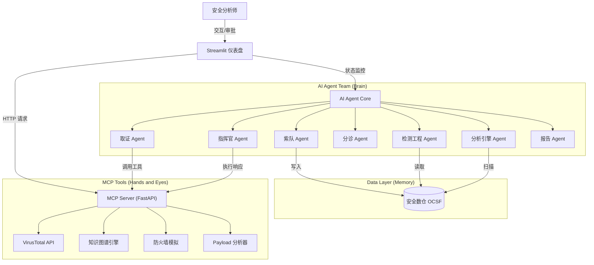

<div align="center">
  
</div>

# 🛡️ Agentic SOC Parallel Simulation (ASPS): 自主安全运营平行仿真中心

> **重新定义安全运营的未来：全栈 SOC 平行仿真、七大智能体协同与数据驱动的自主防御**

本项目是一个**前沿的 Agentic SOC 平行仿真平台**，旨在探索 **Large Action Model (LAM)** 在网络安全领域的极限潜力。通过集成 **DeepSeek 强推理引擎**、**多智能体协同 (Multi-Agent Collaboration)** 与 **MCP (Model Context Protocol)** 标准，我们构建了一个**全栈式、全流程、全自动**的虚拟 SOC 团队。

在这里，AI 不再是简单的脚本执行者，而是具备**专家级思维链 (Chain of Thought)** 的数字分析师。从**紫队**生成攻击流量，到**蓝队**开发检测规则，再到**运营团队**的分诊、取证与响应，七大智能体在**平行空间**中自主演练、自我进化。它能够像人类专家一样，从海量数据中抽丝剥茧，构建动态攻击图谱，并果断采取行动，将安全运营的效率与智能化水平提升至新的维度。

### 📸 Dashboard V2.0 (Latest)


### 📸 Dashboard V1.0 (Legacy)


### 📺 YouTube 演示视频 (V2.0): https://www.youtube.com/watch?v=XFazCM4x4b4

### 📺 YouTube 演示视频 (V1.0): https://www.youtube.com/watch?v=_gRINAQaKmo

## ✨ 核心亮点 (Key Highlights)

*   **♾️ 全栈 SOC 平行仿真 (Full-Stack SOC Parallel Simulation)**
    *   **超越单一分析师**：本项目不仅仅模拟一个 AI 分析师，而是仿真了**整个 SOC 运营体系**。
    *   **全生命周期覆盖**：从红队攻击模拟 -> 紫队数据生成 -> 蓝队规则开发 -> 引擎检测 -> 分诊调查 -> 应急响应 -> 报告归档。
    *   **真实架构映射**：完整复刻了现代 SOC 的核心组件，包括安全数仓 (Data Warehouse)、检测引擎 (Detection Engine)、SOAR 编排与可视化作战室。

*   **🤖 多智能体协同蜂群 (Multi-Agent Collaboration)**
    *   **七大角色各司其职**：模拟真实 SOC 组织架构，七大智能体通过共享上下文无缝协作，展现出超越单体的群体智能：
        *   **😈 紫队工程师 (Purple Team)**: 基于剧本生成高保真攻击流量与背景噪声 (OCSF 标准)。
        *   **🛠️ 检测工程师 (Detection Eng)**: 分析遥测数据，自动开发与验证检测规则。
        *   **⚙️ 分析引擎 (Analysis Engine)**: 运行检测逻辑，扫描数仓，触发告警。
        *   **🔍 分诊 (Triage)**: 过滤误报，评估告警可信度。
        *   **🕵️‍♂️ 取证 (Forensics)**: 调用工具进行深度调查，构建攻击链路。
        *   **🛡️ 指挥官 (Commander)**: 制定处置策略，执行封禁或请求审批。
        *   **📝 报告 (Reporter)**: 汇总调查结果，生成结构化安全报告。

*   **📊 数据驱动的检测工程 (Data-Driven Detection Engineering)**
    *   **安全数仓 (Security Data Warehouse)**: 内置轻量级数仓，支持 OCSF (Open Cybersecurity Schema Framework) 标准数据的存储与检索。
    *   **遥测数据观测**: 提供可视化的数据透视表，让分析师能够直接观测原始遥测日志（Telemetry），验证数据质量与攻击特征。
    *   **检测工程工作台**: 专用的工作区，展示从“数据”到“规则”的转化过程，实现检测逻辑的透明化与可解释性。

*   **🧠 深度推理与认知智能 (Deep Reasoning & Cognitive Intelligence)**
    *   搭载 **DeepSeek** 强推理引擎，具备类人的逻辑分析与决策能力。
    *   **思维链 (Chain of Thought)**：能够处理模糊信息，自主规划调查路径，构建完整的证据链，实现从“告警”到“结论”的端到端自动化。

*   **🕸️ 动态全息图谱 (Dynamic Threat Graph)**
    *   基于 `streamlit-agraph` 实时构建攻击链路的可视化知识图谱。
    *   **通用图谱构建引擎**：内置归属、交互、因果三大通用连接原则，无论是 APT 攻击还是勒索软件，都能自动构建出环环相扣的攻击叙事。
    *   **拒绝孤立节点**：强制关联实体，将碎片化的线索（IP、域名、文件、漏洞）重组为直观的攻击叙事。

*   **🛡️ 异步人机共生 (Async Human-AI Symbiosis)**
    *   创新的 **HITL (Human-in-the-Loop)** 机制，确保 AI 在自主行动的同时，关键决策（如全网封禁）始终处于人类专家的监管之下。
    *   **非阻塞式交互**：采用 `PENDING_APPROVAL` 机制，AI 提交高危操作申请后继续执行其他任务，等待人类专家在仪表盘进行异步确认。

## 🏗️ 系统架构详解

本项目采用分层架构设计，模拟真实的企业级安全运营环境：



1.  **仪表盘 (Streamlit)**: `app/main.py`
    - 安全分析师的可视化作战中心。
    - **检测工程工作台**: 展示数据生成与规则开发过程。
    - **安全数仓视图**: 实时查看 OCSF 遥测数据。
    - **作战室**: 实时展示 Agent 的调查全过程和知识图谱。

2.  **MCP 服务器 (FastAPI)**: `mcp_server/main.py`
    - 充当 Agent 的“手脚”。
    - 提供标准 API 供 Agent 调用。
    - 包含真实/模拟的安全工具逻辑。

3.  **AI Agent (Python)**: `agent/`
    - **`core.py`**: 运营的“大脑”。定义了基础 `Agent` 类以及七大专业角色（紫队、检测、引擎、分诊、取证、指挥官、报告）。
    - **`engine.py`**: 分析引擎，负责将 OCSF 遥测数据与检测规则进行匹配。
    - **`ocsf.py`**: 定义 OCSF (Open Cybersecurity Schema Framework) 数据模型。

## ⚙️ 执行流程示例 (平行仿真场景)

以下展示了系统如何处理一个完整的平行仿真演练：

1.  **剧本定义**: 用户输入攻击剧本（例如 Lazarus APT 攻击）。
2.  **数据生成 (Step 1)**: **紫队工程师** 生成包含正常背景噪声和恶意行为的 OCSF 遥测数据，并存入安全数仓。
3.  **规则开发 (Step 2)**: **检测工程师** 分析数仓中的遥测数据，自动编写检测规则。
4.  **引擎扫描 (Step 3)**: **分析引擎** 运行规则，扫描数仓，触发告警。
5.  **分诊 (Triage)**: **分诊工程师** 分析告警可信度，判定为高风险，转交取证。
6.  **取证 (Forensics)**: **取证工程师**
    - 调用 `check_ip_reputation` 确认源 IP 为恶意。
    - 调用 `analyze_payload` 识别附件为恶意下载器。
    - 调用 `graph_add_relation` 构建图谱：`IP(45.33...)` --[投递]--> `Host(Workstation)`。
7.  **关联分析**: 当后续收到 "C2 Connection" 告警时，Forensic Agent 自动将其关联到已有的 `Host(Workstation)` 节点，形成攻击链路。
8.  **响应 (Commander)**: **指挥官** 判定威胁确凿，尝试封禁 C2 IP。
9.  **人工审批 (HITL)**: 触发 `PENDING_APPROVAL`，分析师在界面点击“批准”。
10. **报告 (Reporter)**: **报告工程师** 自动生成包含完整证据链和处置结果的 Markdown 报告。

## 🚀 快速开始

### 1. 环境准备

克隆项目并安装依赖：

```bash
pip install -r requirements.txt
```

### 2. 启动服务

你需要打开两个终端窗口分别运行以下命令：

**终端 1：启动 MCP 工具服务器**
```bash
python3 -m uvicorn mcp_server.main:app --reload --port 8000
```

**终端 2：启动 Web 仪表盘**
```bash
python3 -m streamlit run app/main.py
```

### 3. 配置与体验

1.  **访问界面**: 打开浏览器访问 `http://localhost:8501`。
2.  **配置 API Key**: 在左侧边栏的 **"系统配置"** 中输入你的 `DeepSeek API Key` 和 `VirusTotal API Key`（可选）。配置仅在当前会话有效，无需修改本地文件。
3.  **平行仿真演练**:
    *   在侧边栏的 **"♾️ 平行仿真演练 (Parallel Simulation)"** 区域，输入或使用默认的攻击剧本。
    *   点击 **"🚀 启动全流程演练"**。
    *   系统将自动执行数据生成、规则开发和引擎检测，随后进入 SOC 处置流程。
4.  **观察与交互**:
    *   观察 **"SOC Team"** 区域，看不同角色的 AI 工程师如何接力工作。
    *   在 **"安全数仓"** 区域，查看生成的 OCSF 遥测数据。
    *   在 **"知识图谱"** 区域，查看实时构建的攻击链路。
    *   当遇到高危操作时，在 **"人工决策"** 区域进行批准或拒绝。

## 📂 项目结构

```
.
├── app/                # 前端界面 (Streamlit)
│   └── main.py         # 主程序：UI 布局、状态管理、可视化
├── mcp_server/         # 工具服务 (FastAPI)
│   └── main.py         # 提供 IP 信誉查询、防火墙、图谱管理等 API
├── agent/              # Agent 核心逻辑
│   ├── core.py         # 定义 Agent 类和 ScenarioGenerator 类
│   ├── engine.py       # 分析引擎：负责规则匹配与告警触发
│   └── ocsf.py         # 数据标准：OCSF 遥测数据模型定义
├── requirements.txt    # 项目依赖
└── README.md           # 项目文档
```
